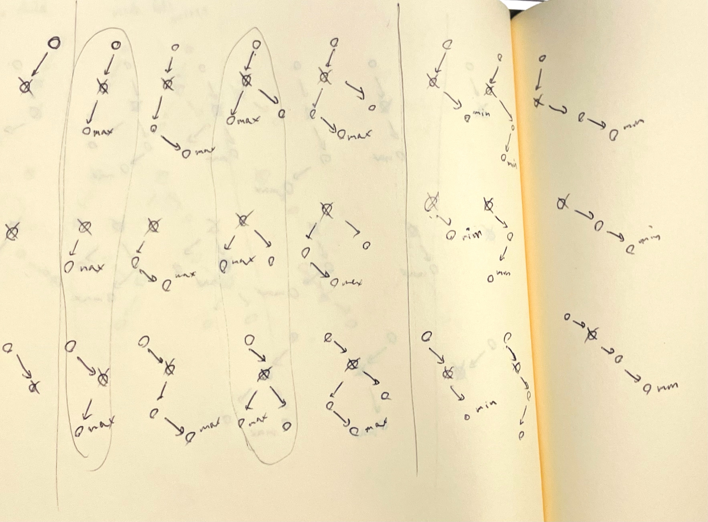

# BinarySearchTree (BST)

## Delete

If it's not self-balancing binary search tree, deleting node is quite complex in BST.

- Leftmost cases (no child)
- Middle cases (has left child)
- Rightmost cases (only has right child)

